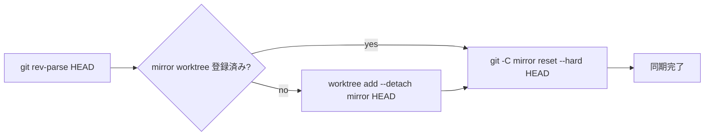

# 同期の仕組み

[← ドキュメント一覧](index.md)

musiderun は git worktree を使った **一方通行ミラー同期** を行います。Job ごとに独立した worktree を使い、複数 Job を順次実行します。**対象はコミット済み（HEAD）の内容のみ**で、メインリポジトリの作業ツリー・index・ブランチには一切触れません。

## 処理の流れ

1. リポジトリルート（`Assets` の親）を基準に git worktree を使用
2. メインの HEAD コミットを取得（`git rev-parse HEAD`）
3. ミラー worktree が無ければ **detached HEAD** で作成（`git worktree add --detach <mirror> <HEAD>`）
4. ミラー worktree を `git reset --hard <HEAD>` で HEAD の内容へ同期
5. ミラー worktree 上で別 Unity プロセスをバッチ起動

## メインプロジェクトの保護

- **メインプロジェクトの作業ツリー・index・ブランチは一切変更しません**（HEAD を読み取るだけ）
- ミラーは detached HEAD の worktree であり、専用ブランチ（`musiderun/mirror-*`）は作成しません
- メインで `add` / `commit` / `checkout` / `reset` などは実行しないため、未コミット変更が消えることはありません

## 対象範囲（重要）

- **コミット済み（HEAD）の内容のみがミラーされます。未コミットの変更（作業ツリーの変更・ステージ・未追跡ファイル）はビルド/テストの対象外です。**
- ビルド/テストしたい変更は、実行前に commit してください。
- HEAD が無い（最初のコミットが未作成の）場合はエラーになります。

## 同期対象外

`Library/`, `Temp/` 等は HEAD に含まれないため同期対象外で、ミラー側で独自に生成されます。ミラーの `Library/` は `reset --hard` で消えないため、増分ビルドのキャッシュとして再利用されます。

## .gitignore の自動チェック（補助機能）

musiderun はメインリポジトリ直下の `BatchJobLogs/`（および設定した `logOutputDirectory`）へログ/レポートを書き込みます。これらを誤って commit しないよう、Job 実行開始時に `.gitignore` 登録を自動チェックし、不足していれば `# === musiderun (auto-managed) ===` セクションへ追記します（`.gitignore` が無ければ作成）。

- 同期そのものには必須ではありません（HEAD のみが対象のため）。誤コミット防止の補助機能です。
- 手動で実行・確認したい場合は `Tools/musiderun/Check .gitignore Entries` メニュー、または musiderun ウィンドウの `Check .gitignore` ボタンを使用します
- ビルド成果物などはミラー worktree 側に生成されるため、本チェックの対象外です

## プラットフォーム固有の扱い

Windows では CRLF 警告を避けるため、ミラー用 git 操作に `core.autocrlf=false` / `core.safecrlf=false` を適用します。

## 関連ドキュメント

- worktree の配置と掃除: [worktree.md](worktree.md)
