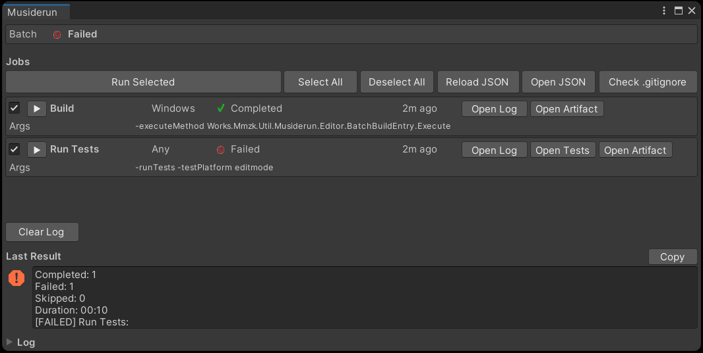
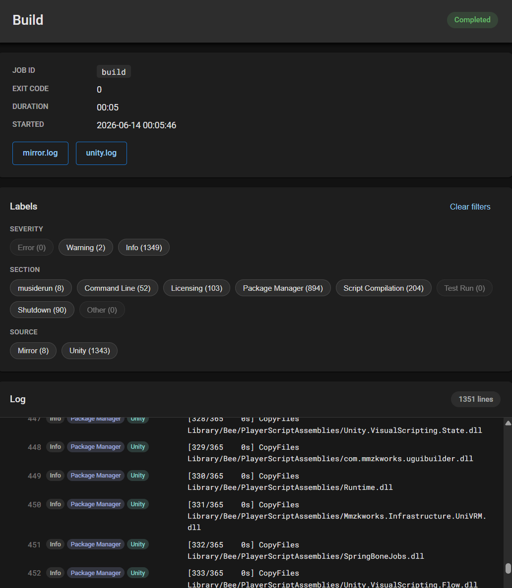
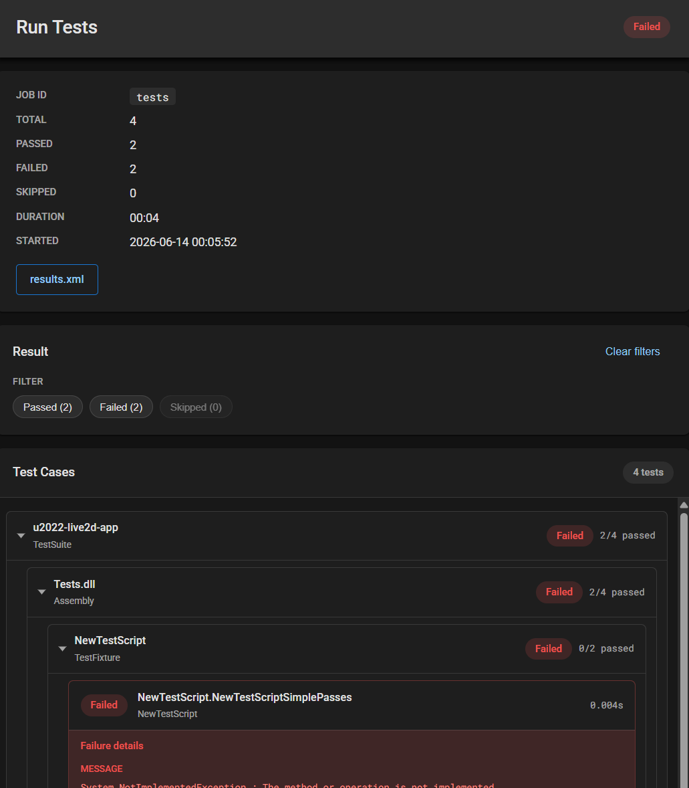

# musiderun (概念検証中)

Unity Editorで開発を続けたまま、バックグラウンドでプロジェクト複製を使ったテスト実行、ビルド実行ができるようにしたいパッケージです。
git worktree によるミラー同期と、別 Unity プロセスでのバッチビルド・テスト実行を行います。

※git cloneした階層と同階層に、git worktreeによる複製フォルダが Job 数分作られるので、置き場所にはご注意ください。

このリポジトリは **デモ用 Unity プロジェクト** と **UPM パッケージ本体**（`Assets/UnityPackages/works.mmzk.util.musiderun`）を同梱しています。

## これは何？

Unity Editor向けのエディタ拡張です。
JSONでコマンドライン操作をJobとして定義して、それらを１クリックで一括順次実行することで、一連のタスクを実行できるようにします。
gitの利用を前提としていて、都度最新commitをもとにした複製を作成・更新したものを使って実行が行います。
実行時点の **HEAD（コミット済み）** の内容のみがミラーされます。未コミットの変更は対象外です。
そのため **今Editorでやっている作業と平行して** 、ビルド・テスト実行等が行えるようになります。

また、ビルド・テスト実行の結果ログを見やすいHTML装飾したものとしてWebブラウザ表示します。
これにより **ログ読み・テスト結果読みがやりやすくなります。**

**エディタウィンドウ**

`Tools > musiderun` から開きます。



### Open Logから開く HTML化された Unity コマンドライン実行ログ

通常そのままだと大変読みづらいUnityのコマンドライン実行ログを、色付け・フィルタ可能なものとして表示します。



### Open Testsから開く HTML化された Unity テスト実行結果

xml出力されたテスト実行結果をHTML化・色付け・絞り込み可能なものとして表示します。



## 要件

- Unity **2022.3 LTS** 以降（Unity 6 含む）
- git（PATH に通っていること）
- macOS / Windows

> デモプロジェクトは Unity 6000.3.13f1 で作成していますが、パッケージ本体（`works.mmzk.util.musiderun`）は Unity 2022.3 以降のプロジェクトに導入できます。

## 導入方法

### A. このリポジトリを試す（デモプロジェクト）

パッケージは `Assets/UnityPackages/` に同梱済みのため、`Packages/manifest.json` への追記は不要です。

```bash
git clone https://github.com/uisawara/musiderun.git
```

1. Unity Hub でクローンしたプロジェクトを開く
2. `Tools/musiderun/Create Settings JSON` で設定ファイルを作成（未作成の場合）
3. `Tools/musiderun/Open Window` でウィンドウを開く

### B. 既存プロジェクトへ UPM（Git URL）で導入

リポジトリを Public にしたうえで、導入先の `Packages/manifest.json` の `dependencies` に追加します。

```json
{
  "dependencies": {
    "com.mmzkworks.util.musiderun": "https://github.com/uisawara/musiderun.git?path=Assets/UnityPackages/works.mmzk.util.musiderun"
  }
}
```

バージョンを Git タグで固定する場合（`package.json` の `version` とタグ名を揃える）:

```json
"com.mmzkworks.util.musiderun": "https://github.com/uisawara/musiderun.git?path=Assets/UnityPackages/works.mmzk.util.musiderun#v0.0.2"
```

導入後:

1. `Tools/musiderun/Create Settings JSON` で `Assets/Settings/MusiderunSettings.json` を作成
2. `Tools/musiderun/Open Window` でウィンドウを開く

> Package Manager の検索には表示されません。`manifest.json` への追記が必要です。

## 注意: git worktree は clone 先の外に作られます

Job 実行時にミラー用 git worktree がプロジェクトの**外**（既定: `../{プロジェクト名}-musiderun-{jobId}`）に自動作成されます。**clone 先を削除しても worktree は残る**ため、不要時は手動で整理してください。Play モード中は Job を実行できません。

詳細は [Docs/worktree.md](Docs/worktree.md) を参照してください。

## ドキュメント

- [Docs 一覧](Docs/index.md) — 設定・同期の仕組み・ログレポートなど技術詳細
- [パッケージ README](Assets/UnityPackages/works.mmzk.util.musiderun/README.md) — 基本操作

## ライセンス

[MIT License](LICENSE)
